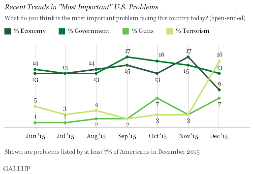

## Outline

- Why Terrorism?

- Terrorism by the Numbers

- Terrorism Globally

```{r setup, include=FALSE}
knitr::opts_chunk$set(echo = FALSE)
```
# Why Terrorism?

## Why Terrorism?



## Why Terrorism?

- Since 1970, there have been about 3,227 terrorist attacks a year

- On average, there are 7,046 deaths a year due to terrorist attacks

# Terrorism by the Numbers

## Terrorism by the Numbers


## Terrorism by the Numbers


## Terrorism by the Numbers


## Terrorism by the Numbers


## Terrorism by the Numbers


## Terrorism by the Numbers


# Terrorism Globally

## Terrorism Globally

```{r}
library(googleVis)
library(openxlsx)
library(dplyr)
gtd = read.xlsx('globalterrorismdb_0615dist.xlsx')
attacks_per_country = gtd %>% group_by(country_txt) %>% summarise(Attacks = n())

```

## Terrorism Globally

```{r, results='asis'}
plot(gvisGeoChart(attacks_per_country, "country_txt", "Attacks",
                  options=list(projection="kavrayskiy-vii")), "chart")
```

# Thank you

