    
#A Song of Ice and Fire

## Data
- A Song of Ice and Fire is a book series by George R. R. Martin on which the HBO series Game of Thrones is based.
\pause

## Attention!

> - Don't worry if you've never read the books or watched the tv show!
> - Spoiler alert!

## About the series

> - Five books, each averaging almost 1000 pages.

\pause

\begin{enumerate}

\item A Game of Thrones (AGOT)

\item A Clash of Kings (ACOK)

\item A Storm of Swords (ASOS)

\item A Feast for Crows (AFFC)

\item A Dance With Dragons (ADWD)

\end{enumerate}

\pause

\includegraphics[width = 100pt]{Bookset.jpg}

##About the series

> - Extremely complex collection of characters.

> - Each chapter has a point of view (POV) character. Action is narrated in the limited third person from the perspective of the POV character.

#Questions

##Initial quesitons

> - Best book?

> - Favorite characters?

> - Arc of the books

> - Character arcs

> - Do my opinions match the concensus?

##Data

> - I scraped data from [Tower of the Hand](http://towerofthehand.com/books/guide.html), a self titled "Encyclopedia of Ice and Fire."
> - Fan created reference for the books and tv show, with content such as:
\begin{itemize}
\item Character lists
\item Family trees
\item Maps
\item Historical timeline
\item Chapter guides
\end{itemize}

##Data
I gathered the following information for each chapter:

> - Book
> - Chapter number in book
> - POV character
> - Chapter name
> - Chapter blurb 
> - Summary ^[Not all are available for A Dance with Dragons.]
> - Characters appearing in the chapter
\begin{itemize}
\item There are 1111 characters!
\end{itemize}
> - Score of the chapter (voting by users) -- rating from 1 to 10

#Chapter score data visualization

##Chapter scores
\pause
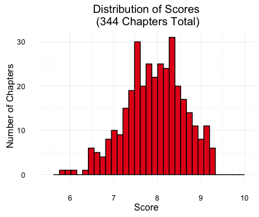

##Book scores
\pause
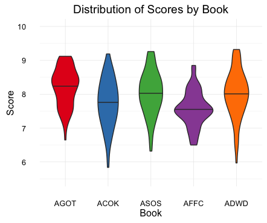

##POV characters
\pause
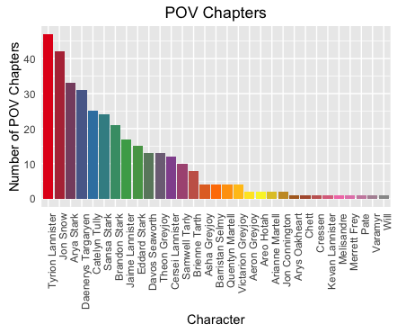

##Main POV characters
\pause
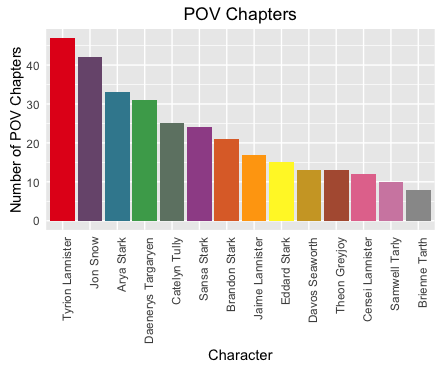

##POV chapter scores
\pause
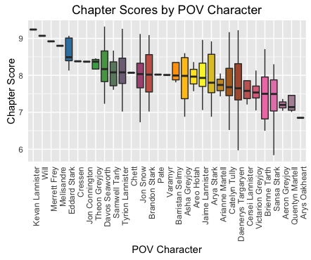

##Main POV chapter scores
\pause
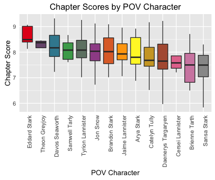

#Chapter Shiny app

##All chapters
[Shiny app for chapters](https://rtcastellano.shinyapps.io/ASOIAF/)

Have fun and explore all the chapters! See where your favorite chapters and characters rank.

#Summary word clouds for POV characters

##All chapters
\pause
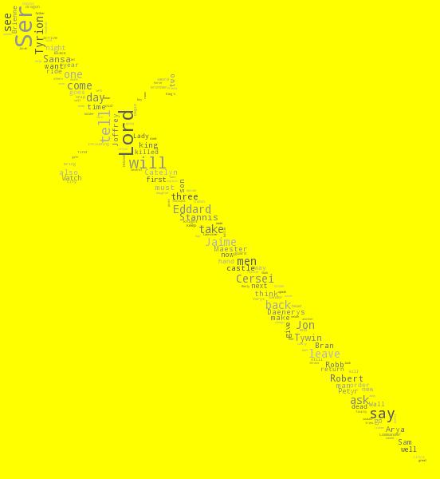

##Tyrion Lannister
\pause
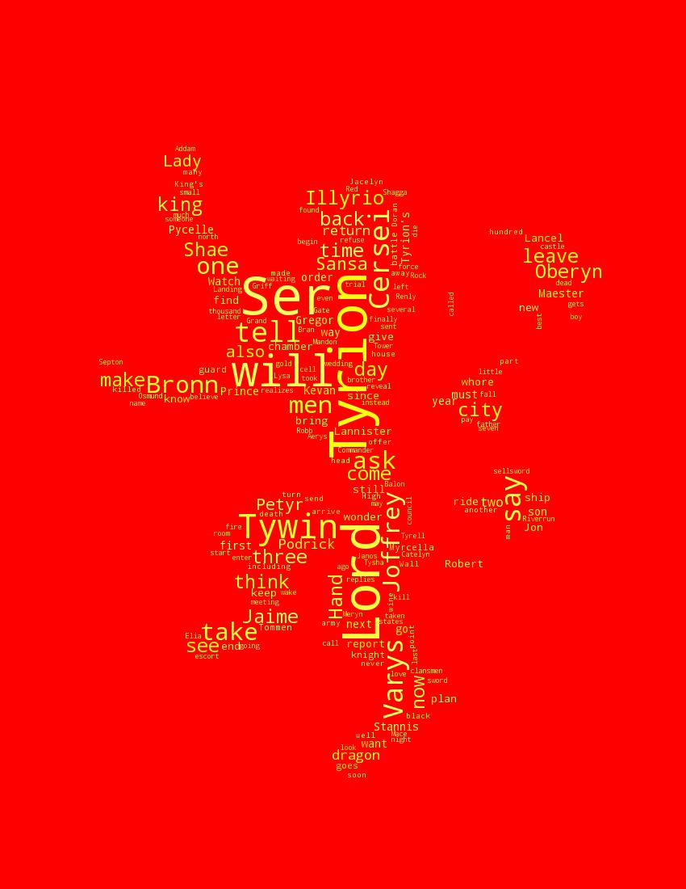

##Jon Snow
\pause
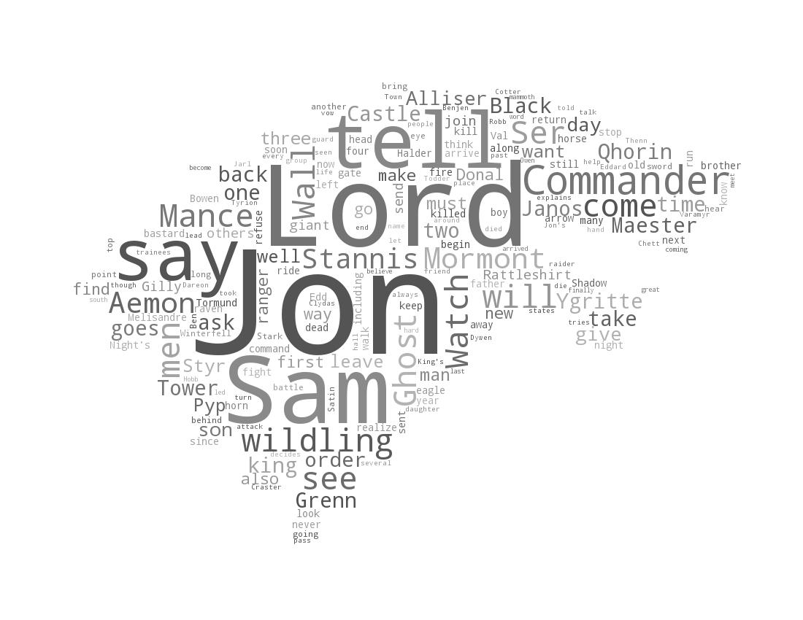

##Daenerys Targaryen
\pause
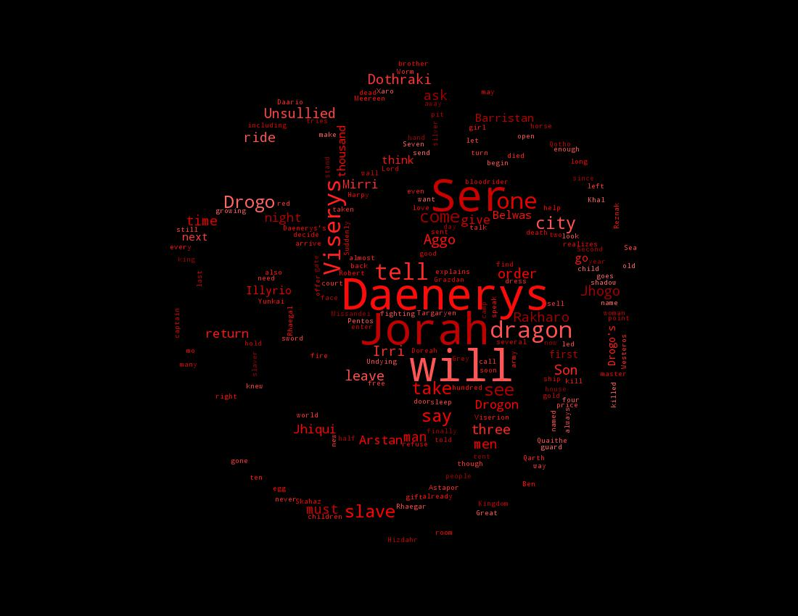

##Arya Stark
\pause
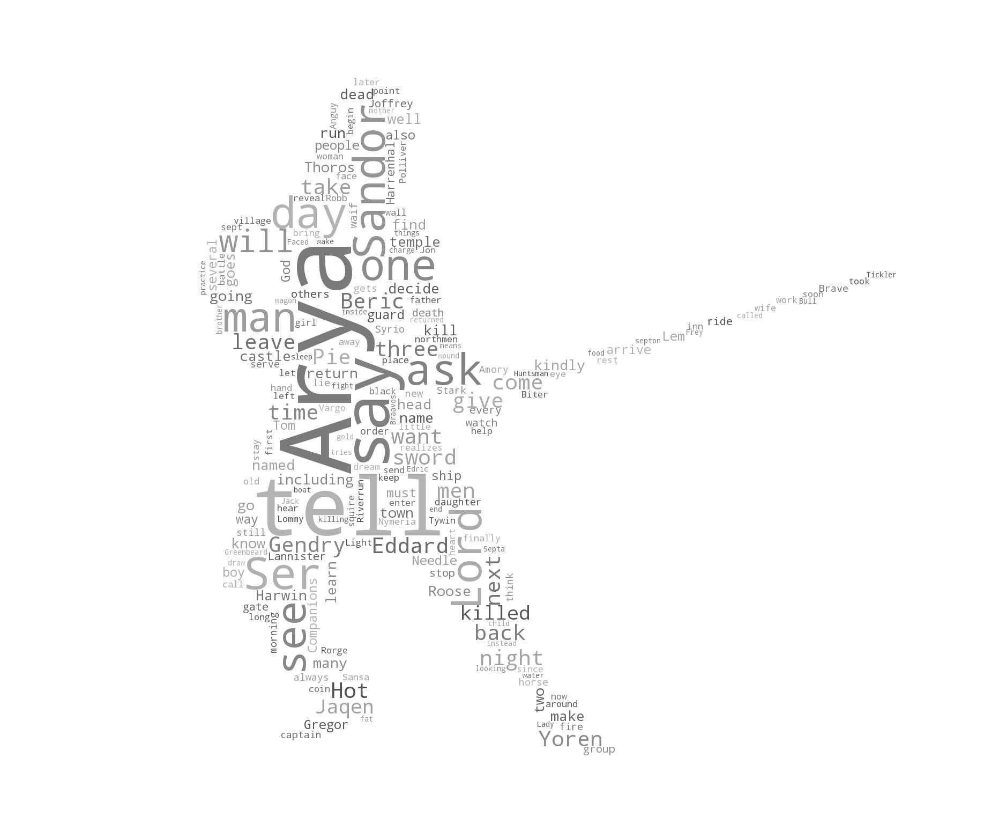

##Catelyn Tully
\pause
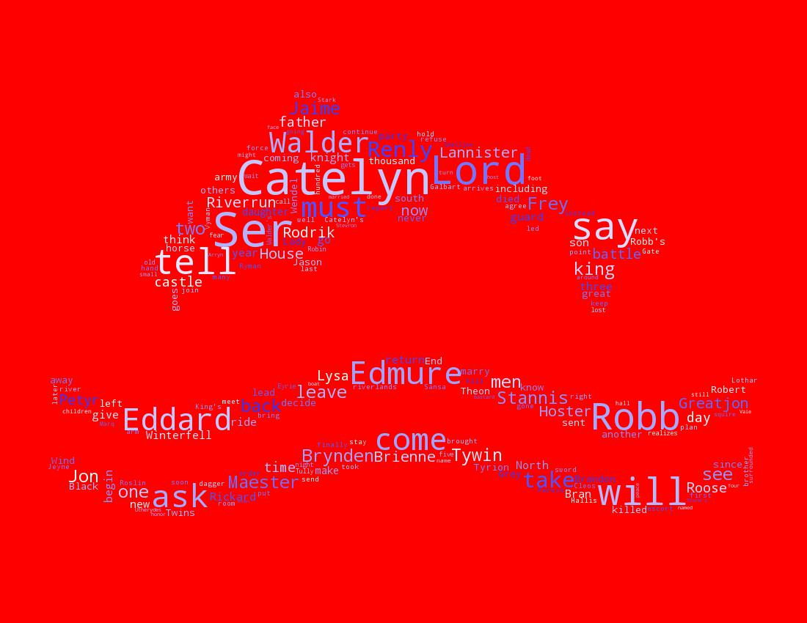

##Bran Stark
\pause
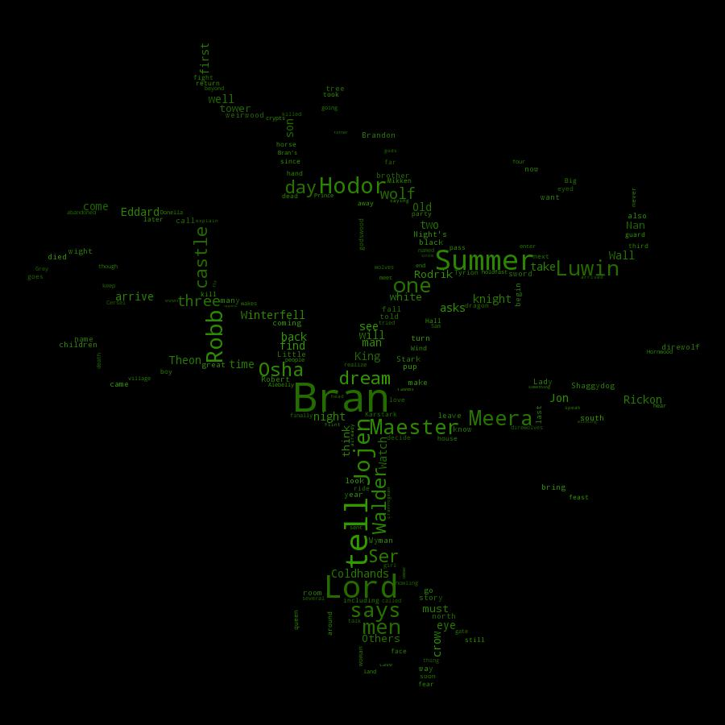

##Greyjoys (Theon, Asha, and Aeron)
\pause
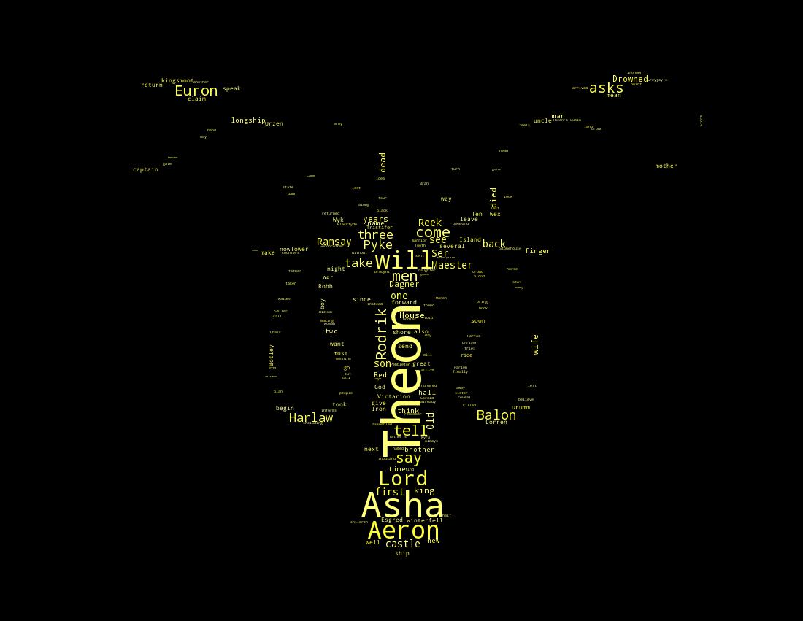

##Arianne Martell
\pause
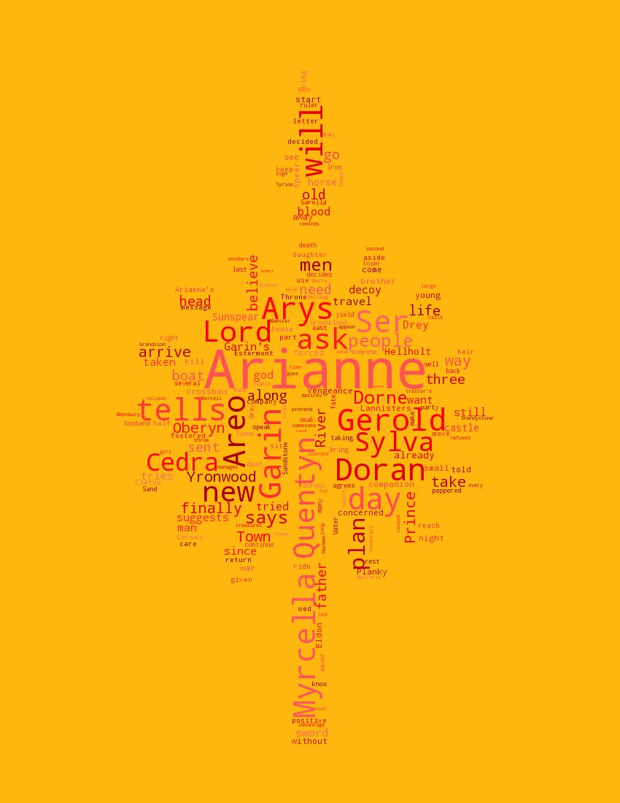

#Conclusion

##Further directions

> - Analyze chapter scores by book quantile (third, quarters, etc.)

> - More natural language processing using chapter summaries

> - Relationships between characters using the information of characters appearing in each chapter

